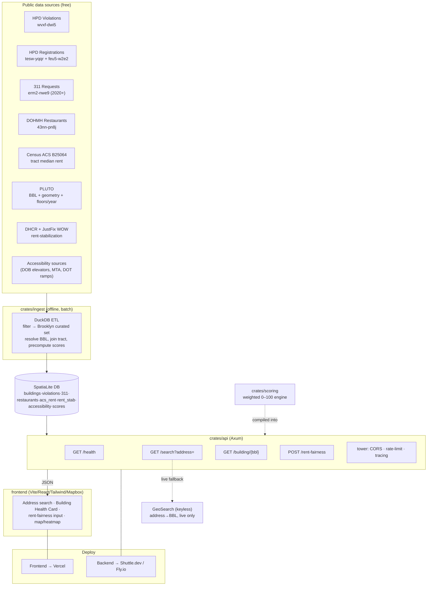
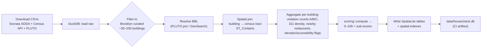
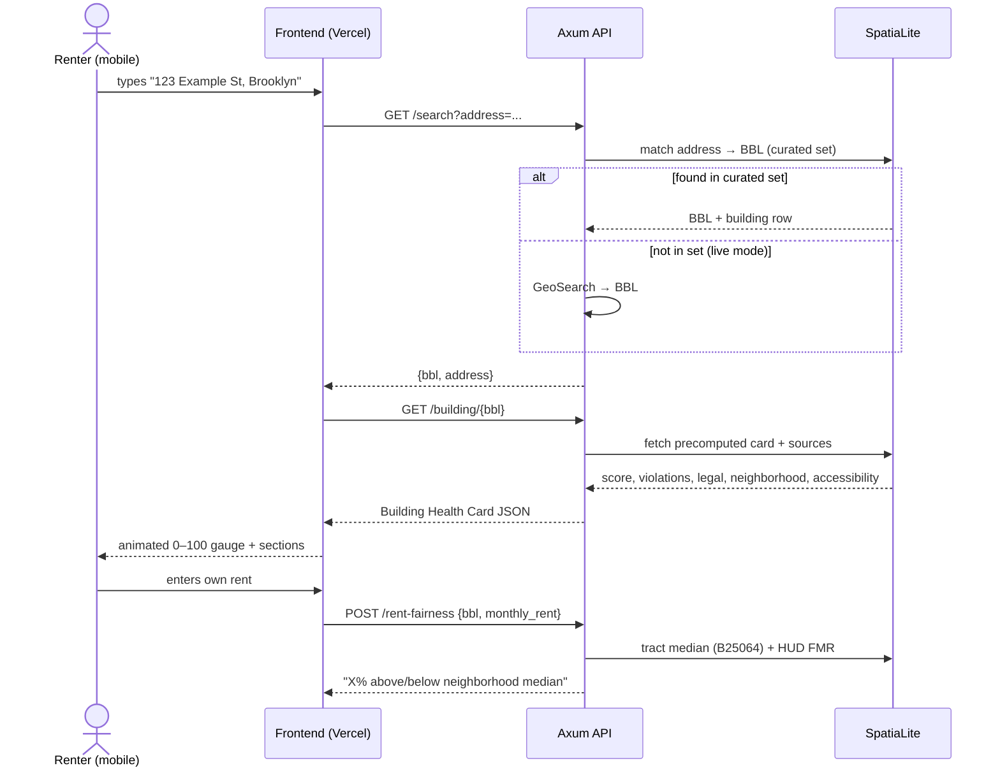
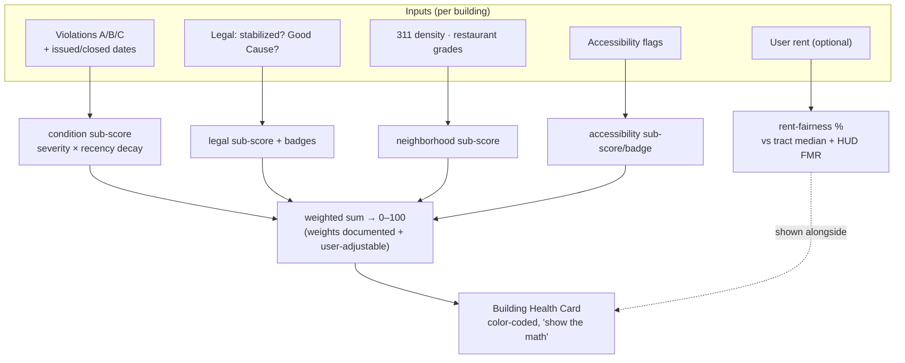
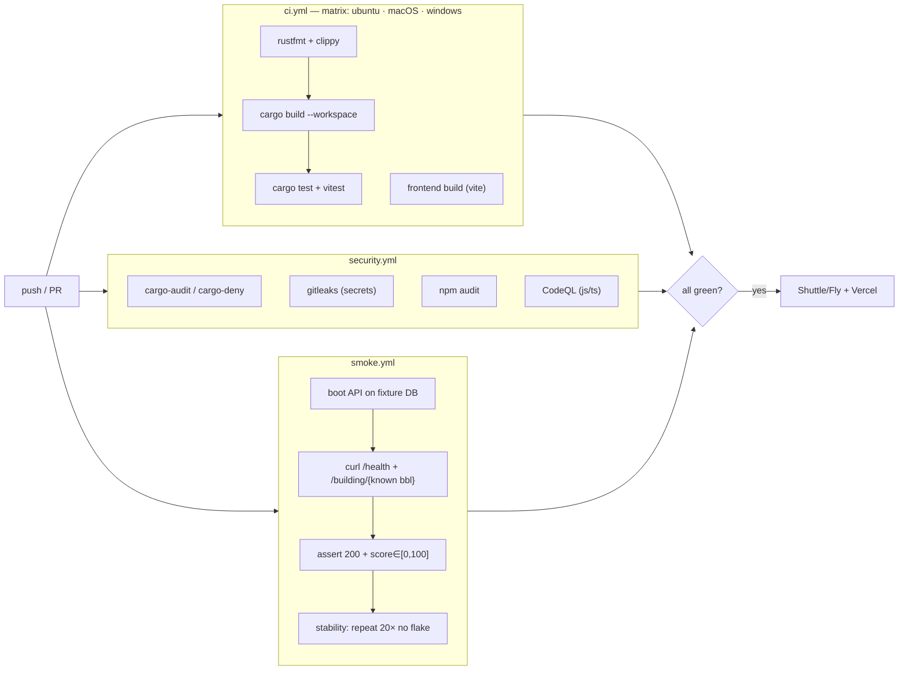

# HouseCheck — Technical Flow Diagrams

Companion to `docs/superpowers/specs/2026-07-21-housecheck-design.md`. Diagrams render on GitHub / any Mermaid viewer.

Planned repo layout (referenced throughout):

```
housecheck/
├─ Cargo.toml            # Rust workspace
├─ crates/
│  ├─ ingest/            # DuckDB → SQLite/SpatiaLite ETL (binary)
│  ├─ scoring/           # 0–100 Building Health Card engine (lib)
│  └─ api/               # Axum HTTP API (binary: housecheck-api)
├─ data/
│  ├─ raw/               # downloaded open-data CSVs (gitignored)
│  └─ housecheck.db      # built SpatiaLite DB (gitignored; artifact)
├─ frontend/             # Vite + React + TS + Tailwind + Mapbox
└─ .github/workflows/    # ci, security, smoke
```

---

## 1. System / container diagram



---

## 2. Ingest pipeline (offline, run once + on refresh)



---

## 3. Request flow — address search → Health Card



---

## 4. Scoring engine



---

## 5. Data model (core tables)

```mermaid
erDiagram
    BUILDINGS ||--o{ VIOLATIONS : has
    BUILDINGS ||--o{ COMPLAINTS_311 : has
    BUILDINGS ||--o{ REGISTRATIONS : has
    BUILDINGS ||--o{ ACCESSIBILITY : has
    BUILDINGS }o--|| ACS_RENT_BY_TRACT : in_tract
    BUILDINGS ||--o| RENT_STAB : may_be
    BUILDINGS ||--|| SCORES : precomputed
    BUILDINGS {
        text bbl PK
        text bin
        text address
        geometry geom
        text tract_geoid FK
        int year_built
        int num_floors
    }
    VIOLATIONS { text bbl FK, text class, date issued, date closed }
    COMPLAINTS_311 { text bbl FK, text complaint_type, date created }
    REGISTRATIONS { text bbl FK, text owner, text agent }
    ACCESSIBILITY { text bbl FK, bool has_elevator, bool near_ada_subway, int curb_ramps_nearby, bool fha_era }
    ACS_RENT_BY_TRACT { text tract_geoid PK, int median_gross_rent }
    RENT_STAB { text bbl FK, text source, text confidence }
    SCORES { text bbl FK, int total, int condition, int legal, int neighborhood, int accessibility }
```

---

## 6. CI / CD pipeline


